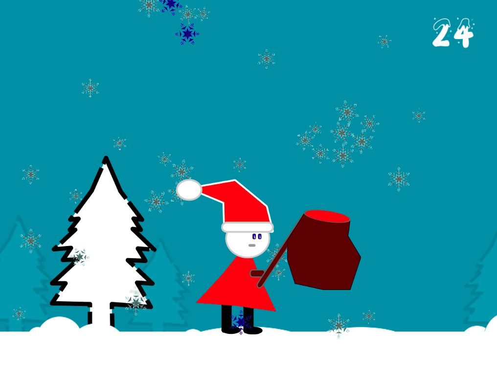

# growman

Dev platform: Unity 2018.2.14f, Visual Studio 2017 Community version 15.9.3, Windows 10; 
Targest platform: WebGL (Referenz resolution: 1024 * 768)

The player has to collect blue snowflakes in 30 seconds by moving the character left and right along the x axis.
As input serve the arrow keys. Pressing left/right for movement and down for flipping the character.
In the game over scene the score will be shown. Further the size of the snowman adapts based on the collected snowflakes.

